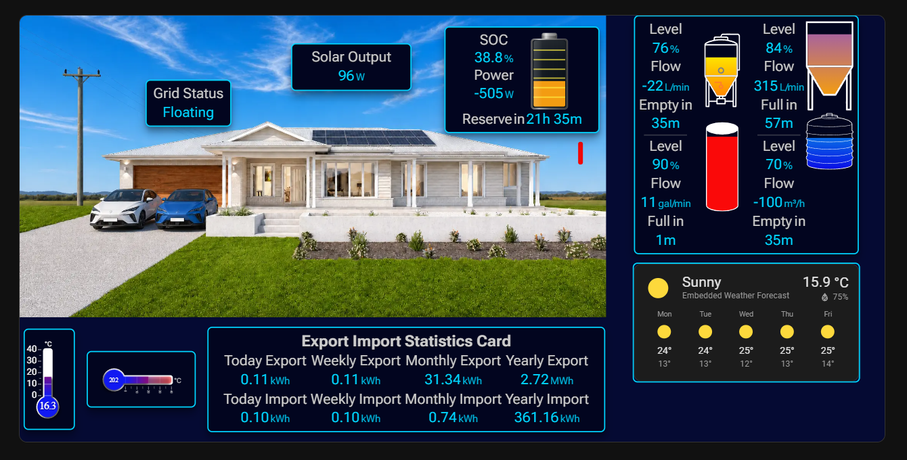
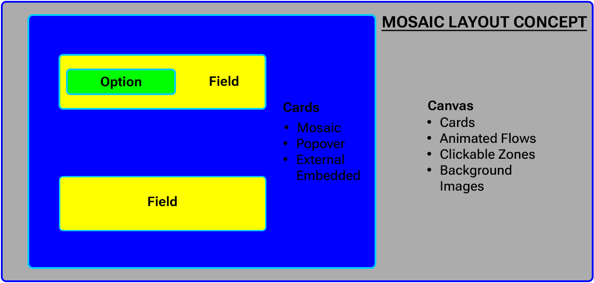

# Mosaic Canvas Card


A Home Assistant dashboard card that turns a **background image into a layout**  
**surface**. Place text, icons, SVG gauges, charts and real interactive controls  
anywhere on the image by dragging them; the whole layout scales as one piece on any  
screen, from phone to wall panel.

**📖 Full documentation: [ratava.github.io/mosaic-canvas-card**](https://ratava.github.io/mosaic-canvas-card/)

> **Status: pre-release.** In daily use and feature-complete enough to build real  
> dashboards with; the configuration schema may still change between versions.  
> Release notes live on the [GitHub Releases page](https://github.com/ratava/mosaic-canvas-card/releases).

## What it does

- **Freeform layout over a photo or render** — position cards anywhere on the image,  
in free pixel (Precision) mode or snapped to a grid.
- **Live backgrounds** — day/night image sets swapped by sun position, an entity, or  
pinned; extra image variants per EV count.
- **A visual element library** — thermometers, batteries, four tank shapes, an  
inverter and arc gauges, plus statistics and history graphs.
- **Real interactive controls** — toggles, sliders, dropdowns, button groups, inputs,  
spinboxes and buttons that write back to Home Assistant and are fully stylable.
- **Animated flow lines** — energy or data movement traced between the things you  
have placed, speed and direction driven by an entity.
- **Popover cards, clickable zones, embedded cards and virtual entities** — detail  
panels, invisible hotspots, any other Lovelace card on the canvas, and computed  
helper values with no Home Assistant helper required.
- **A full visual editor** — everything above is configured by drag, drill-down  
menus and live preview. YAML remains first-class for power users.

## Possible Use Cases

Not limited to

- Power monitoring dashboard 
  - Up to 2 EV's supported
- General Status Monitoring
- Dashboards
- Kiosk displays

## Installation

### HACS (recommended)

1. In Home Assistant, open HACS, click the ⋮ menu → **Custom repositories**.
2. Add `https://github.com/ratava/mosaic-canvas-card` with category **Dashboard**.
3. Find **Mosaic Canvas Card** in HACS and install it.
4. HACS registers the Lovelace resource automatically. If the card doesn't appear
  after a browser hard-refresh, add the resource manually  
   (Settings → Dashboards → ⋮ → Resources):  
   `/hacsfiles/mosaic-canvas-card/mosaic-canvas-card.js` as a **JavaScript Module**.

### Manual

1. Download the latest release and copy the contents of `dist/` into
  `config/www/community/mosaic-canvas-card/`.
2. Add `/local/community/mosaic-canvas-card/mosaic-canvas-card.js` as a
  **JavaScript Module** resource.
3. Hard-reload the browser after every update to bust the cache.

### Your first card

Add **Mosaic Canvas Card** from the dashboard card picker, or by YAML with  
`type: custom:mosaic-canvas`. A setup wizard runs the first time and offers to  
tailor the starting configuration; a guided tour of the editor follows. You'll want  
a background image available under `/local/` (your `config/www/` folder) — the  
wizard asks for it.

## Core concepts

Mosaic has a small number of ideas that repeat everywhere — the  
[Core Concepts](https://ratava.github.io/mosaic-canvas-card/concepts/) page covers  
them in five minutes.



**The hierarchy: Canvas → Cards → Fields → Options.** The **canvas** is a fixed  
design-space grid laid over your background image; the whole canvas scales as one  
piece, so a layout built on a desktop holds together on a phone. **Cards** are  
positioned boxes on it. **Fields** are the content stacked inside a card — labels,  
entity values, icons, Element Library shapes, graphs, interactive controls, even  
another Lovelace card. Each field type carries its own **options**, and the editor  
only ever shows the ones that apply.

**Beyond cards:** popover detail panels, invisible clickable **zones** pinned to the  
image itself, **embedded** Lovelace cards positioned on the canvas, animated  
**flows**, and **virtual entities** — computed helpers (arithmetic, min/max,  
time-until countdowns) pickable anywhere a real entity is, no HA helper required.

**The defaults system.** Every visual property resolves most-specific-first:

```
1. The element's own setting        (this field / this card)
2. Your Global Default              (Settings › Global Defaults)
3. Mosaic's shipped default         (how a fresh card looks out of the box)
4. Your Home Assistant theme
5. A built-in fallback
```

Set nothing and you get Mosaic's shipped look; set a Global Default and every card  
and field follows it installation-wide; override on one element and only it differs.  
Wherever an override is possible the editor shows an inherit/override switch, and  
**Clear overrides** is the one-click way back.

**Styling beyond the options.** Two permanent, first-class escape hatches: **Custom**  
**Colors & Variables** (name a value once under Global Defaults, reference it  
everywhere — named colours appear in every colour picker) and **Additional CSS**  
(free-form declarations on boxes, text styles and each Element Library shape, layered  
cumulatively). If something can't be restyled through these, that's considered a gap  
in Mosaic's styling surface — please file an issue.

## The visual editor

Everything Mosaic can do is reachable from the visual editor — see the  
[Editor Guide](https://ratava.github.io/mosaic-canvas-card/editor/).

- **The ribbon** — three tabs: **Cards** (Mosaic Card · Popover Cards · Embedded  
External Cards), **Elements** (Animated Flow Lines · Clickable Zones · Virtual  
Entities), **Settings** (Canvas · Global Defaults · Templates · Config Health).  
Every screen is a list of items, a sections menu, or a form; a tappable breadcrumb  
always shows where you are.
- **The Mosaic Editor Window** — a fullscreen drag surface with the live card  
rendered inside it: drag cards, zones and flow points anywhere, resize with  
handles, multi-select to align and distribute.
- **Search** — the box at the top of the ribbon finds every screen that contains a  
setting name, including per-card and per-field screens.
- **Undo / redo** — every change, including canvas drags, with Ctrl+Z / Ctrl+Y;  
deletions offer an immediate Undo snackbar. Nothing is saved to the dashboard  
until you hit Home Assistant's own Save.
- **Templates** — export and import whole layouts as portable files (with or  
without your entity references), and move saved control-variant packs between  
installations.
- **Config Health** — a read-only checkup that finds dangling references, missing  
entities and YAML-only values, with every finding linking to the screen that owns  
it.

## Documentation

| Page                                                                             | Covers                                                  |
| -------------------------------------------------------------------------------- | ------------------------------------------------------- |
| [Home](https://ratava.github.io/mosaic-canvas-card/)                             | What Mosaic is and where to start                       |
| [Installation](https://ratava.github.io/mosaic-canvas-card/installation/)        | HACS, manual install, your first card                   |
| [Core Concepts](https://ratava.github.io/mosaic-canvas-card/concepts/)           | Canvas/cards/fields, the defaults system, styling, YAML |
| [Editor Guide](https://ratava.github.io/mosaic-canvas-card/editor/)              | The ribbon, editor window, search, undo                 |
| [Editor: Cards](https://ratava.github.io/mosaic-canvas-card/editor/cards/)       | Mosaic cards, fields, popovers, embedded cards          |
| [Editor: Elements](https://ratava.github.io/mosaic-canvas-card/editor/elements/) | Flows, zones, virtual entities                          |
| [Editor: Settings](https://ratava.github.io/mosaic-canvas-card/editor/settings/) | Canvas, Global Defaults, Templates, Config Health       |

## License

[MIT](./LICENSE) © Brent Wesley
